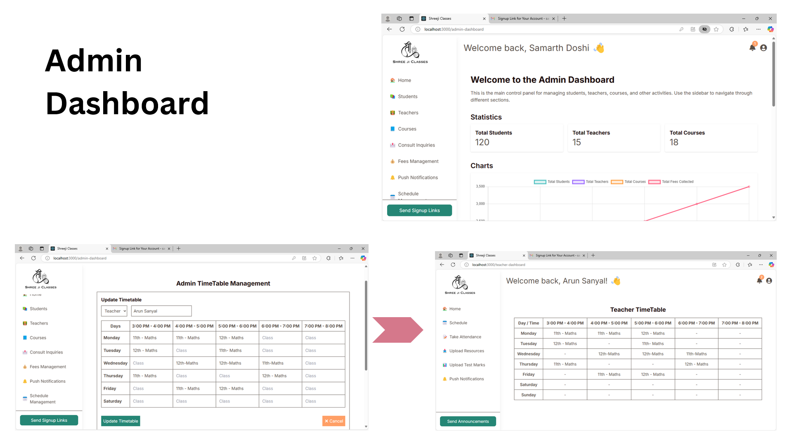
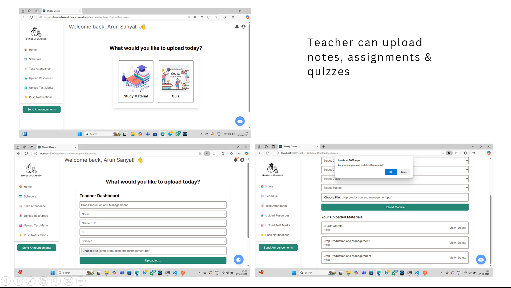
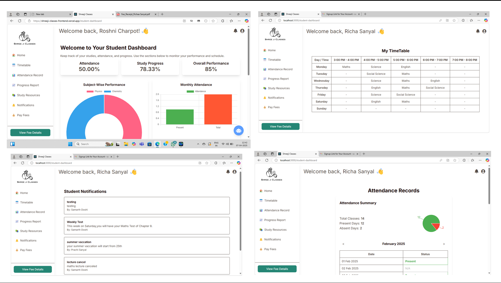
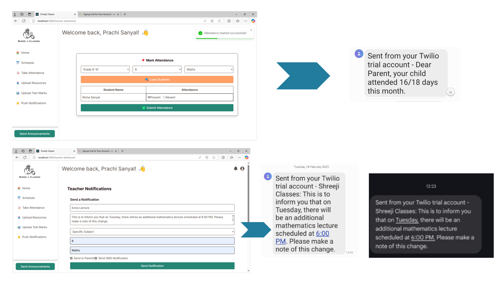
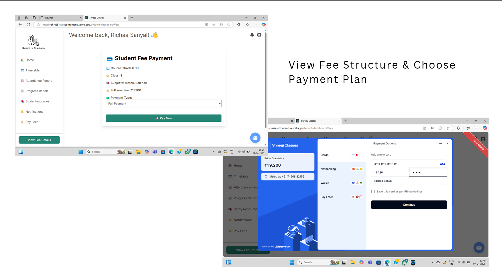
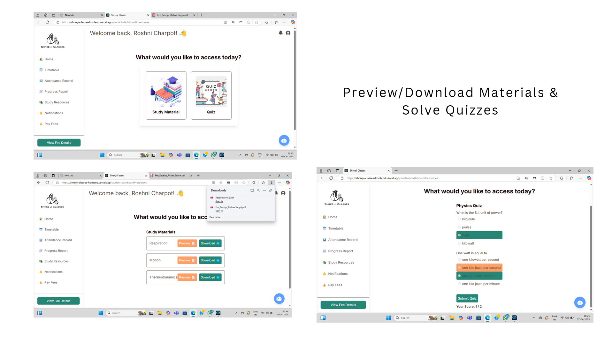
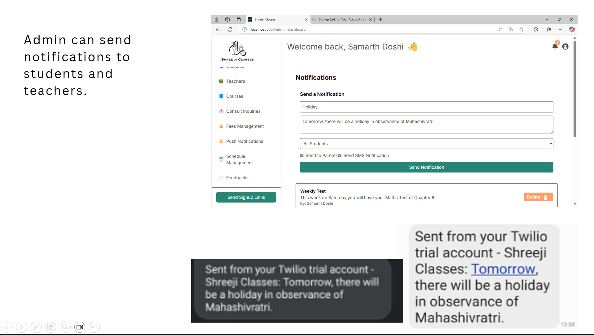

# Shreeji Classes Management System

A full-stack MERN-based coaching institute management platform developed to digitalize and automate the day-to-day operations of coaching institutes.

## Live Demo

🌐 https://shreeji-classes-main.vercel.app/

---

## Project Overview

Shreeji Classes Management System is a comprehensive coaching institute management platform built using the MERN Stack (MongoDB, Express.js, React.js, Node.js).

The application helps coaching institutes manage students, teachers, attendance, courses, study materials, quizzes, fee payments, notifications, inquiries, timetables, and academic performance through a centralized digital platform.

The system provides separate dashboards and role-based access for Administrators, Teachers, and Students, making institute management more efficient and reducing manual administrative work.

---

## Problem Statement

Many coaching institutes still rely on manual processes for:

* Student attendance tracking
* Fee management
* Study material distribution
* Academic performance monitoring
* Parent communication
* Timetable management

This project was developed to streamline these operations through a single web-based platform that improves efficiency, communication, and record management.

---

## Key Features

### Authentication & User Management

* Secure JWT Authentication
* OTP Verification System
* Password Recovery
* Role-Based Access Control
* Admin, Teacher and Student Dashboards

### Course Management

* Add Courses
* Edit Courses
* Delete Courses
* Course Categorization
* Course Information Management

### Student Inquiry Management

* Online Inquiry Submission
* Inquiry Tracking
* Status Management
* Email Notifications

### Attendance Management

* Mark Student Attendance
* Attendance History Tracking
* Attendance Reports
* Parent Notifications

### Fee Management

* Razorpay Payment Integration
* Full Payment Support
* Installment-Based Payments
* Fee Tracking
* Payment History
* Due Amount Monitoring

### Study Material Management

* Upload Notes
* Upload Assignments
* Cloudinary File Storage
* Download Study Materials

### Quiz Management

* Create Quizzes
* Attempt Quizzes
* Instant Evaluation
* Score Tracking

### Performance Management

* Upload Test Marks
* Academic Progress Tracking
* Performance Reports
* Student Result History

### Notification System

* Institute Announcements
* Student Notifications
* Teacher Notifications
* Email & SMS Communication

### Timetable Management

* Student Timetable
* Teacher Timetable
* Timetable Updates
* Schedule Management

---

## Tech Stack

### Frontend

* React.js
* Tailwind CSS
* JavaScript
* HTML5
* CSS3

### Backend

* Node.js
* Express.js

### Database

* MongoDB Atlas
* Mongoose ODM

### Authentication & Security

* JWT Authentication
* Bcrypt Password Hashing
* OTP Verification

### Third-Party Integrations

* Razorpay
* Cloudinary
* Nodemailer
* Twilio
* Google Drive

### Development Tools

* Git
* GitHub
* Postman
* VS Code

---

## System Architecture

Frontend (React.js + Tailwind CSS)

⬇

Backend (Node.js + Express.js)

⬇

MongoDB Database

⬇

Third-Party Services

* Razorpay
* Cloudinary
* Twilio
* Nodemailer
* Google Drive

---

## Screenshots

### Landing Page

### Admin Dashboard

### Teacher Dashboard

### Student Dashboard

### Attendance Management

### Fee Management

### Study Material Module

### Quiz Module

### Notification System

---

## Documentation

Detailed project documentation is available in the repository.

* Software Requirement Specification (SRS)
* Project Presentation
* UML Diagrams
* Database Design
* System Design Documents

---

## What I Learned

Through this project, I gained practical experience in:

* Full-Stack MERN Development
* REST API Development
* JWT Authentication
* Role-Based Authorization
* MongoDB Database Design
* Payment Gateway Integration
* Cloud Storage Management
* Email and SMS Services
* Software Engineering Documentation
* Software Requirement Specification (SRS)
* Deployment and Production Hosting

---

## Future Enhancements

* Parent Dashboard
* Advanced Analytics Dashboard
* AI-Based Student Performance Insights
* Online Live Classes Integration
* Mobile Application
* Push Notifications
* Advanced Reporting System

---

## Author

Prachi Sanyal

Master of Computer Applications (MCA)

GitHub: https://github.com/Prachi-Sanyal

---

If you found this project interesting, feel free to explore the source code and documentation.
